# DoraX — diagram gallery

One diagram per master doc, plus a whole-app overview. Each renders on GitHub. Sources are the
`.mmd` files beside this page. Companion to the [master docs](../README.md).

> Diagrams are drawn from the code-verified surface docs (`../01`…`../10`). Where a doc marks a
> `[gap]` or `[?]`, the diagram shows it too (e.g. the eval gap in #10).

---

## 00 · Whole-app overview

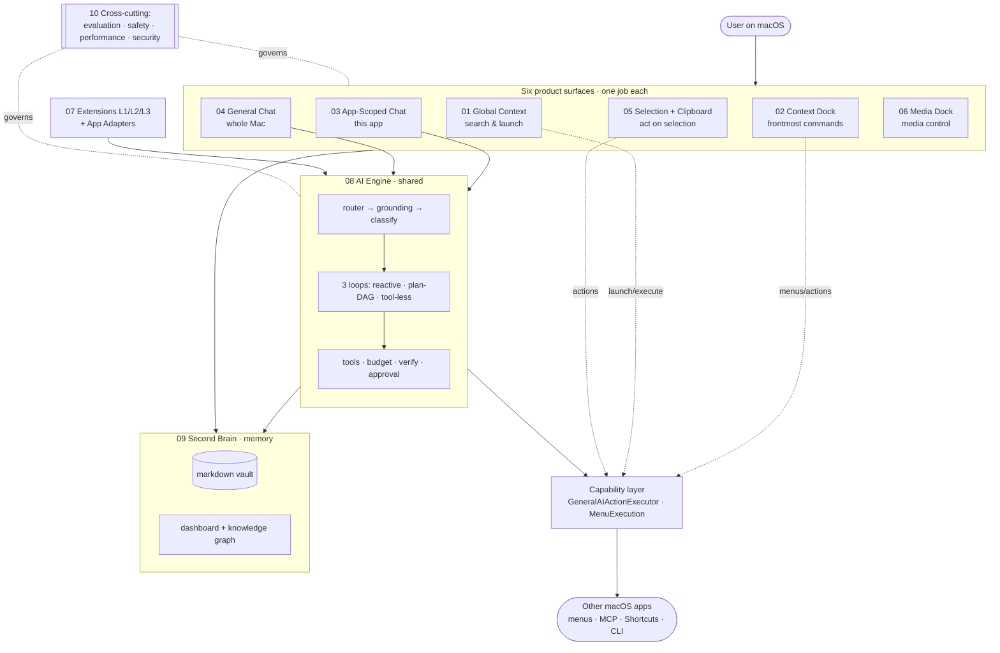

---

## 01 · Global Context

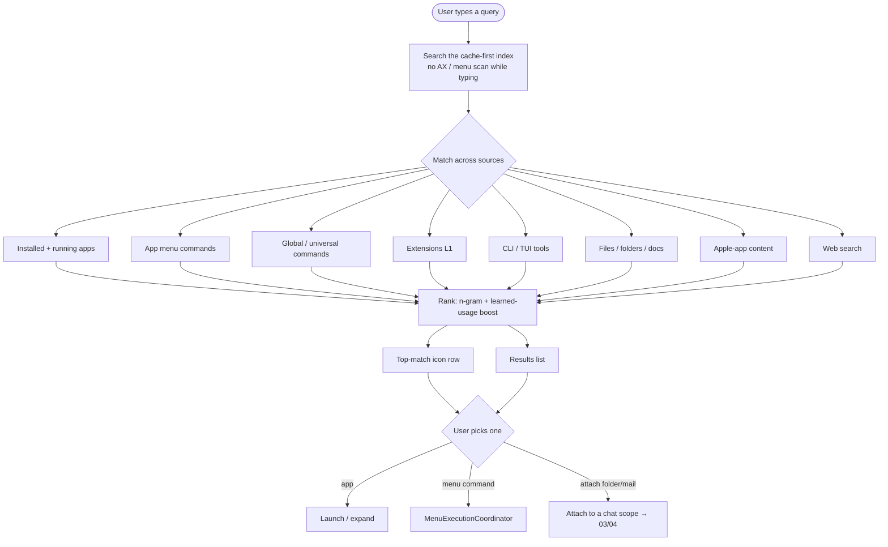

---

## 02 · Context Dock (frontmost command layer)

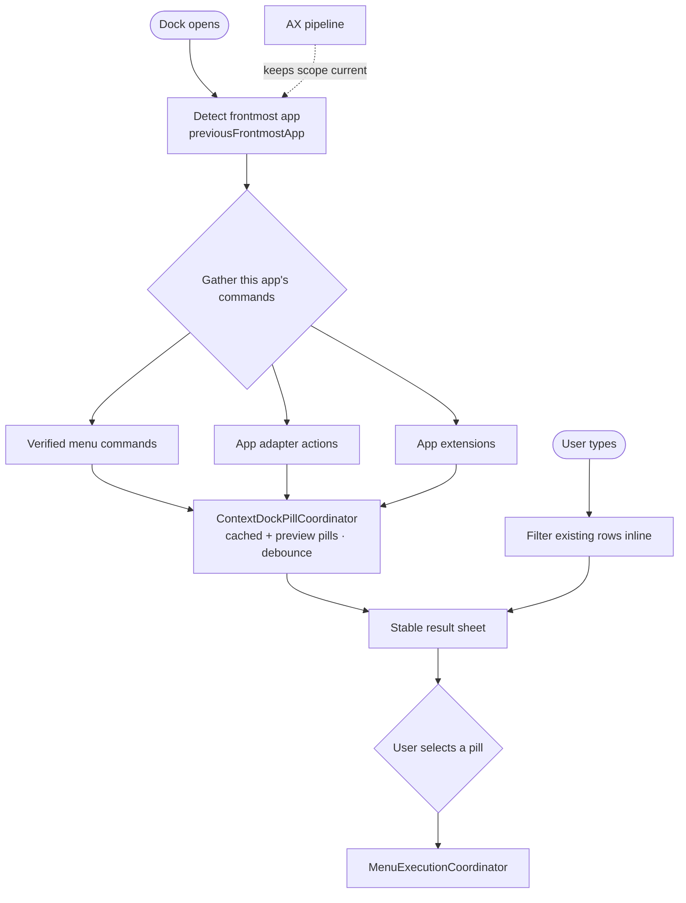

---

## 03 · App-Scoped Chat

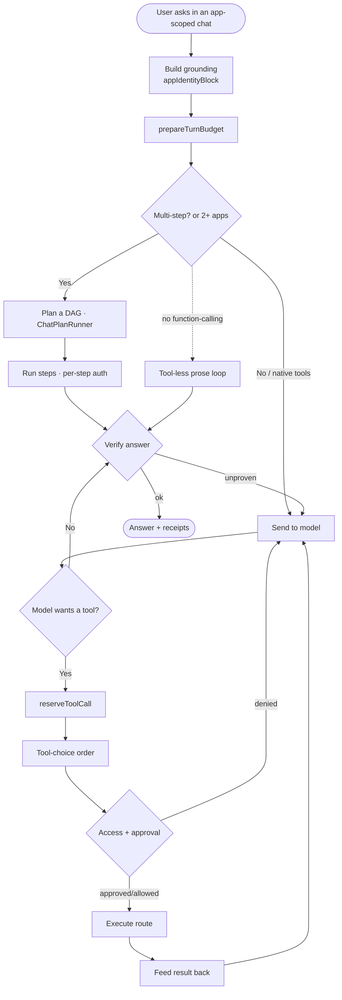

---

## 04 · General AI Chat

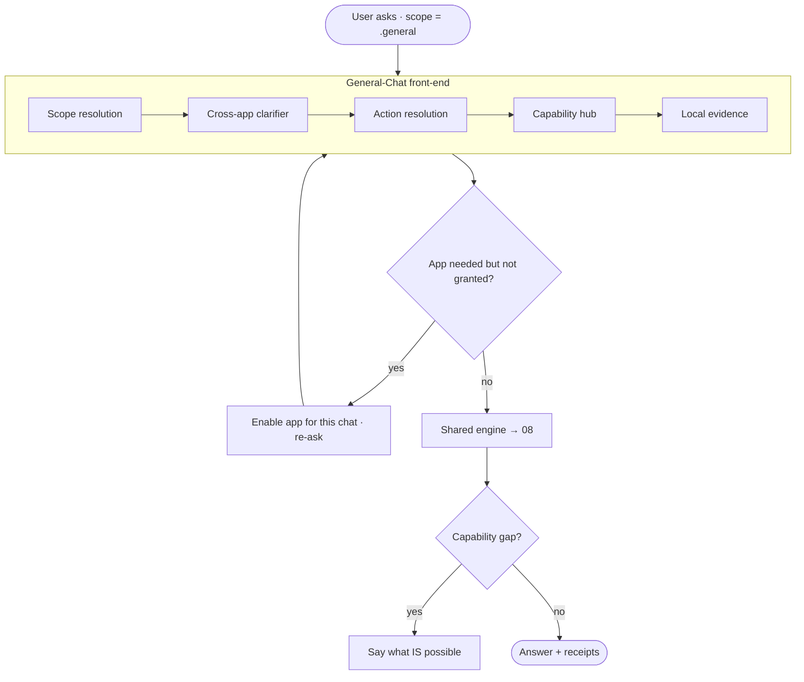

---

## 05 · Selection + Clipboard

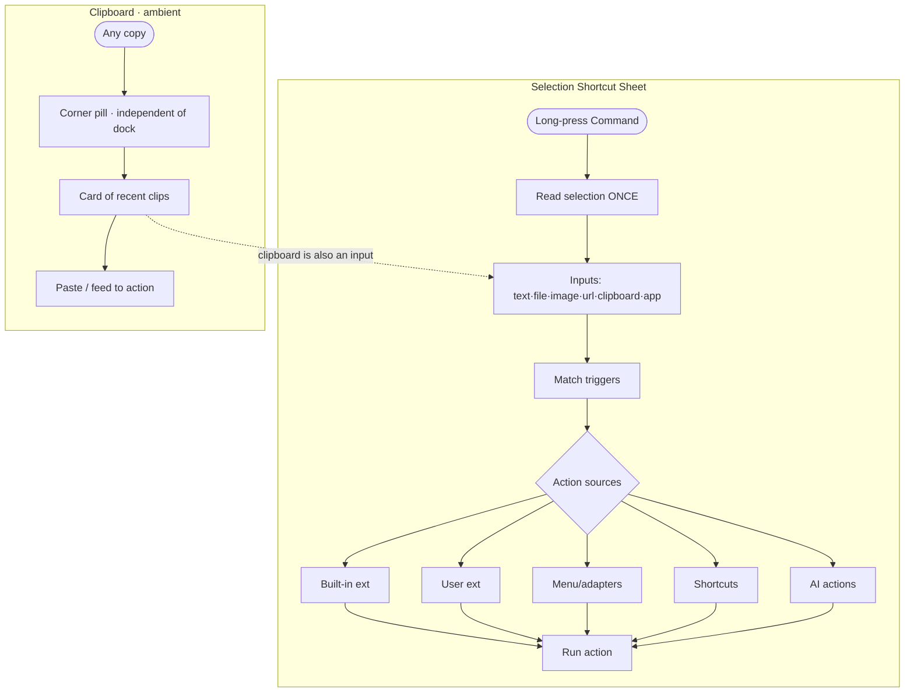

---

## 06 · Media Dock

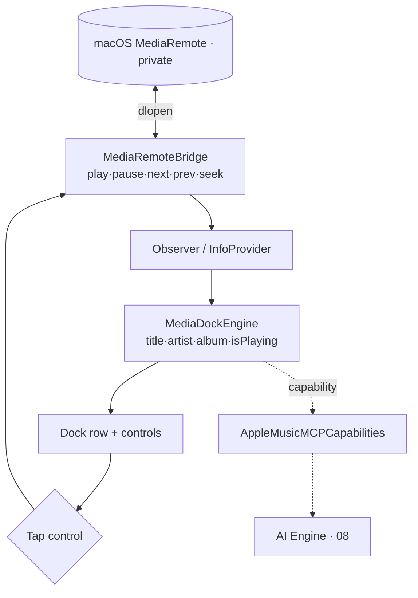

---

## 07 · Extensions (L1/L2/L3)

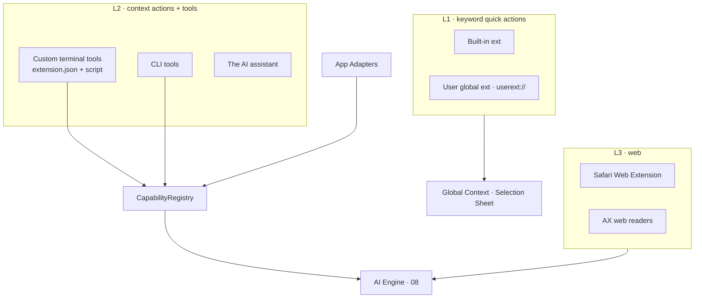

---

## 08 · AI Engine

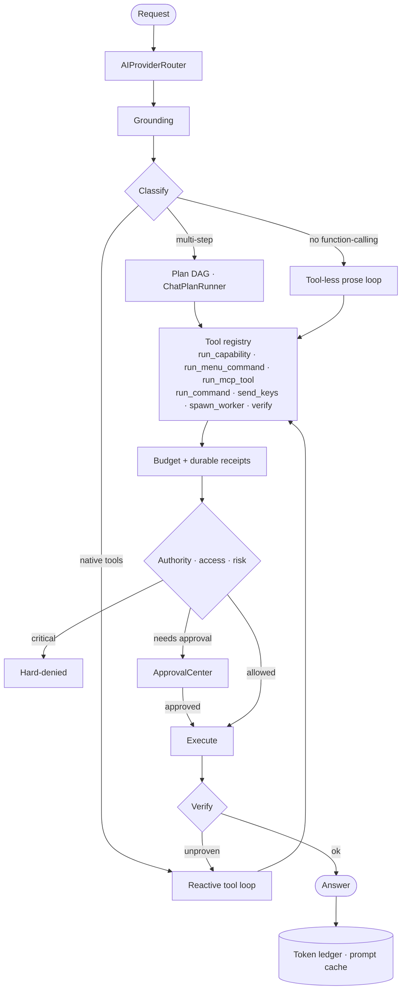

---

## 09 · Second Brain (memory)

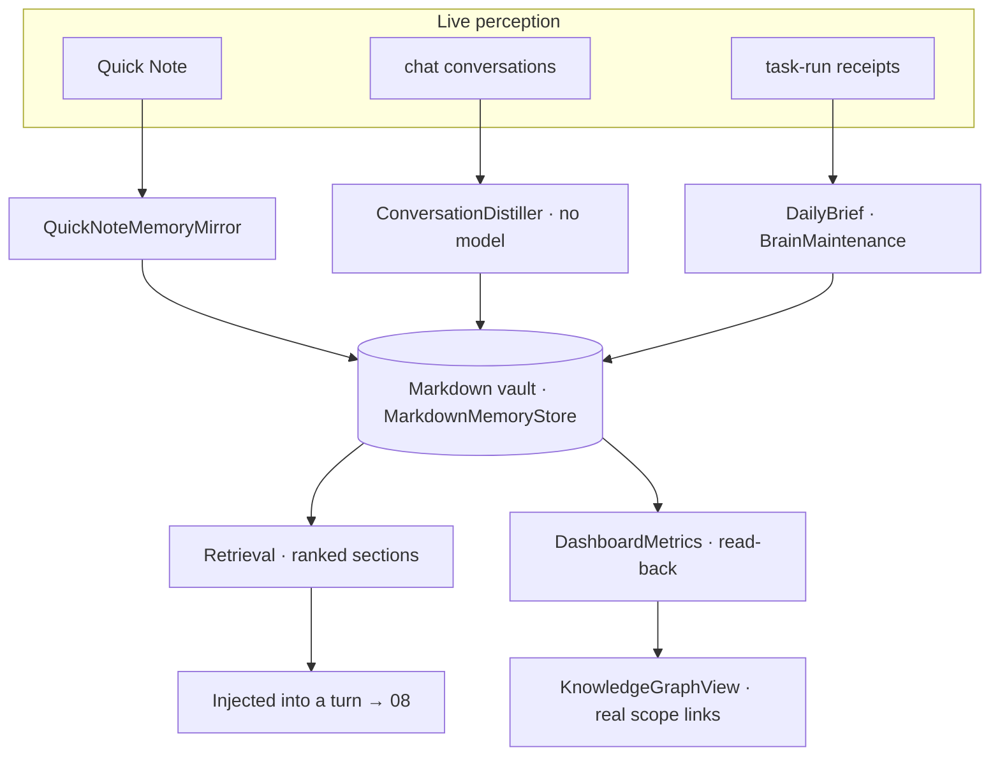

---

## 10 · Cross-cutting (eval · safety · performance · security)

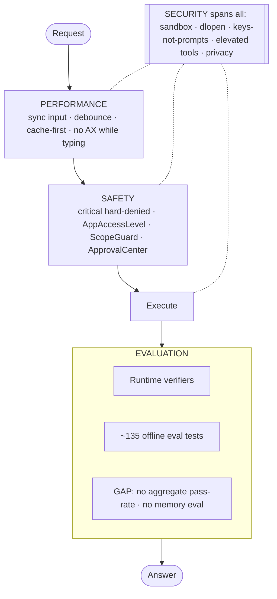
